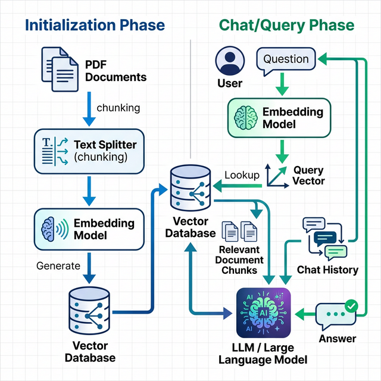
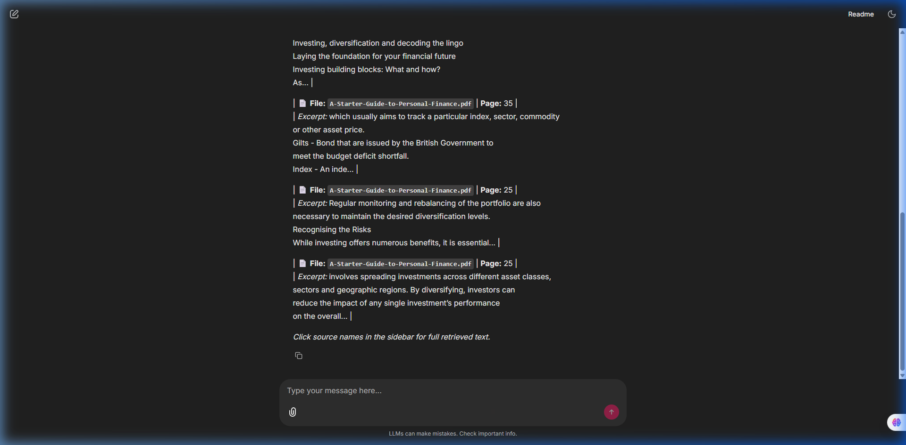

<div align="center">
  
</div>

# 🤖 Agentic RAG Chatbot (Financial & Web Search)

A cutting-edge generative AI chatbot that combines **Retrieval-Augmented Generation (RAG)** with **Agentic Tool Use**. This intelligent assistant doesn't just answer from memory—it dynamically queries internal PDF documents and performs live web searches to find the most accurate, up-to-date information, providing verifiable source proof for every claim.

---

## ✨ Key Features
- **Agentic Decision Making**: Powered by LangChain Agents and Groq's Llama 3 API, the bot autonomously decides *when* to search internal PDFs, *when* to search the live web, and *when* to answer from memory.
- **Local PDF Knowledge Base**: Ingests your custom PDF documents (e.g., Financial Education Booklets) using HuggingFace sentence embeddings and FAISS vector databases.
- **Live Internet Access**: Integrates DuckDuckGo Web Search to answer questions about real-time events, news, or topics outside the local knowledge base.
- **Verifiable "Source Proof" UI**: Unlike standard chatbots, this app provides exact verification for every answer. Clickable source badges reveal the exact PDF filename, page number, paragraph excerpt, or Web URL used to formulate the response.
- **Beautiful Chat Interface**: Built on Chainlit for a premium ChatGPT-like experience featuring streaming text, markdown support, dark mode, and sidebar panels.

---

## 🛠️ Technologies Used
- **Core Framework**: Python 3.13, [LangChain](https://python.langchain.com/) (Agents, Tools, Memory)
- **Large Language Model (LLM)**: [Groq Cloud](https://groq.com/) API running **LLaMA 3.3 70B Versatile** (ultra-fast inference).
- **Embeddings & Vector Store**: `sentence-transformers/all-MiniLM-L6-v2` via HuggingFace, stored locally using **FAISS** index.
- **Web Search**: DuckDuckGo API integration.
- **User Interface**: [Chainlit](https://docs.chainlit.io/) (Dark mode, sidebars, interactive elements).

---

## 🧠 Architecture & Thinking

<div align="center">
  
</div>

### 1. Document Ingestion (RAG)
When the application starts, it reads all PDF files from the `./fin_ed_docs` directory. The text is split into manageable semantic chunks using a `RecursiveCharacterTextSplitter` and converted into dense vector embeddings. These vectors are indexed into a FAISS database for lightning-fast similarity search.

### 2. Multi-Tool Agent
Instead of a simple question-answering chain, the system uses an **Agent Executor** with access to custom tools:
  - `financial_education_pdf_search`: A custom tool function that performs a similarity search on the FAISS database and returns a structured JSON payload containing the file name, page number, and text.
  - `web_search`: A tool that hits the DuckDuckGo Search API to return structured URLs, titles, and snippets.

The LLM (Llama 3) receives the user's prompt, analyzes its intent, and selects the appropriate tool to gather context before synthesizing a final answer.

---

## 🖥️ UI & UX: Verifiable Sources

Transparency is critical for AI. To prevent hallucinations and build trust, the UI was custom-designed to show **real proof** for every answer.

<div align="center">
  
</div>

- **Inline Citations**: The main chat window displays concise tool usage and source labels (e.g., `📚 A-Starter-Guide.pdf (p.9)`).
- **Sidebar Details**: By clicking on a source, users can open the Right Sidebar to view the *exact paragraph* extracted from the PDF or the *exact URL and snippet* retrieved from the web search.

---

## 🚀 Installation & Setup

### Prerequisites
- Python 3.10+
- A [Groq API Key](https://console.groq.com/keys)

### Steps

1. **Clone the repository:**
   ```bash
   git clone https://github.com/Dewick75/RAG_Chat_Bot.git
   cd RAG_Chat_Bot
   ```

2. **Set up a Virtual Environment (Recommended):**
   ```bash
   python -m venv venv
   source venv/bin/activate  # On Windows use `venv\Scripts\activate`
   ```

3. **Install Dependencies:**
   ```bash
   pip install -r requirements.txt
   ```

4. **Environment Variables:**
   Create a `.env` file in the root directory and add your Groq API key:
   ```txt
   GROQ_API_KEY=gsk_your_groq_api_key_here
   ```

5. **Add your Documents:**
   Place any PDF files you want the chatbot to read into the `./fin_ed_docs` folder.

6. **Run the Application:**
   ```bash
   chainlit run app.py -w
   ```
   *The `-w` flag enables hot-reloading. The app will open in your default browser at `http://localhost:8000`.*
